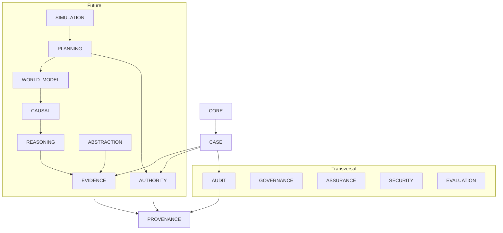

# HAG-RAP V.2 — Architecture Documentation

## Purpose

HAG-RAP V.2 (Human-Governed Deep Reasoning, Abstraction and Planning for Trustworthy Cognitive AI) is a greenfield implementation establishing the architectural foundations for a cognitive AI system where:

- The machine can acquire **capacity** and **operational criteria** through evidence, reasoning, correction, and experience.
- **Ultimate authority** over goals, constraints, and conditions of acceptability remains under **human governance**.

Order 0 establishes the ciments. It does NOT implement cognitive engines (WP3-WP7).

## Limits of Order 0

Order 0 implements:
- Modular architecture with bounded contexts
- Scientific contract (S01-S30)
- Canonical typed IDs
- ResearchCase isolation
- Epistemic semantics
- Evidence foundation
- Provenance infrastructure
- Versioning and supersession
- Orthogonal state model
- Authority as first-class domain
- Human governance foundation
- Simulation/reality separation
- Audit trail (append-oriented)
- External AI adapter boundary
- Persistence interfaces
- Domain errors
- Deterministic testing support
- Scientific maturity model
- UI shell

Order 0 does NOT implement:
- Deep Reasoning engine (WP3)
- Causal Inference engine (WP3)
- Abstraction engine (WP4)
- World Model engine (WP4)
- Planning engine (WP5)
- Formal Assurance engine (WP6)
- Scientific benchmarks (WP7)

## Bounded Contexts Map

```
┌─────────────────────────────────────────────────────────────┐
│                        CORE                                  │
│  (IDs, Errors, Epistemics, Time, Provenance, Versioning)    │
└───────────────────────────┬─────────────────────────────────┘
                            │
┌───────────────────────────▼─────────────────────────────────┐
│                        CASE                                  │
│  (ResearchCase — primary aggregation boundary)              │
└───────────────────────────┬─────────────────────────────────┘
                            │
        ┌───────────────────┼───────────────────┐
        │                   │                   │
┌───────▼───────┐ ┌────────▼────────┐ ┌───────▼───────┐
│   EVIDENCE    │ │   EPISTEMICS    │ │  PROVENANCE   │
│ (Source,      │ │ (Status,        │ │ (cross-cutting│
│  Evidence,    │ │  Classification)│ │  traceability)│
│  Claim, Link) │ │                 │ │               │
└───────┬───────┘ └─────────────────┘ └───────────────┘
        │
┌───────▼───────────────────────────────────────────────────┐
│              FUTURE SCIENTIFIC MODULES                      │
│  REASONING → CAUSAL → ABSTRACTION → WORLD MODEL → PLANNING │
└───────────────────────────┬───────────────────────────────┘
                            │
┌───────────────────────────▼─────────────────────────────────┐
│                     SIMULATION                               │
│  (Controlled execution, counterfactual analysis)            │
└─────────────────────────────────────────────────────────────┘

TRANSVERSAL DOMAINS (cross-cut all layers):
┌──────────┐ ┌──────────┐ ┌──────────┐ ┌───────┐ ┌──────────┐ ┌────────────┐
│AUTHORITY │ │GOVERNANCE│ │ ASSURANCE│ │ AUDIT │ │ SECURITY │ │ EVALUATION │
└──────────┘ └──────────┘ └──────────┘ └───────┘ └──────────┘ └────────────┘
```

## Dependency Graph



## Scientific Data Flow

```
PROBLEM
→ SOURCES
→ EVIDENCE
→ CLAIMS (epistemically classified)
→ FACTS / ASSUMPTIONS / UNCERTAINTIES / CONTRADICTIONS
→ REASONING (WP3)
→ CAUSAL MODEL (WP3)
→ ABSTRACTION (WP4)
→ WORLD MODEL (WP4)
→ GOALS
→ CONSTRAINTS
→ ALTERNATIVE PLANS (WP5)
→ COUNTERFACTUAL EVALUATION
→ SELECTION
→ HUMAN GOVERNANCE
→ CONTROLLED SIMULATION
→ NEW EVIDENCE
→ REVISION
→ REPLANNING
→ RESULT
→ AUDITABLE TRACE
```

## Authority Flow

```
HUMAN defines:
  → Goals (HUMAN_LOCKED)
  → Constraints (NON_NEGOTIABLE)
  → AuthorityPolicy (who can do what)
  → Permissions (within boundaries)

AI operates within:
  → CAPABILITY (what it can technically do)
  → PERMISSION (what it is authorized to do)
  → DISCRETION (what it can modify within scope)

AI CANNOT:
  → Redefine HUMAN_LOCKED goals
  → Weaken NON_NEGOTIABLE constraints
  → Escalate its own authority
  → Fabricate human approval
  → Convert UNKNOWN into PERMISSION
```

## Provenance Flow

Every artifact carries provenance:
- WHO produced it (producer + actorType)
- WHEN (timestamp)
- FROM WHAT INPUTS
- BY WHAT METHOD
- WITH WHAT VERSION
- UNDER WHAT ASSUMPTIONS
- WITH WHAT HUMAN INTERVENTION
- WHAT IT SUPERSEDES
- WHY IT CHANGED

## Simulation/Reality Boundary

```
OBSERVED     → Reality (measured, confirmed)
PREDICTED    → Model output (not yet observed)
COUNTERFACTUAL → Hypothetical (what if)
SIMULATED    → Controlled execution (not real)
REQUESTED    → Intent (not yet executed)
NOT_EXECUTED → Pending
```

INVARIANT: These states NEVER alias each other through any code path.

## WP2-WP7 Future Mapping

| WP | Module | Status | Order |
|----|--------|--------|-------|
| WP2 | Scientific Foundations | Contracts defined | Order 0 |
| WP3 | Deep Reasoning + Causal | Contracts reserved | Future |
| WP4 | Abstraction + World Model | Contracts reserved | Future |
| WP5 | Deep Planning | Contracts reserved | Future |
| WP6 | Integration + Assurance | Contracts reserved | Future |
| WP7 | Benchmarking + Validation | Contracts reserved | Future |

## Forbidden Dependency Patterns

1. **No circular dependencies** between bounded contexts
2. **UI must not import** domain internals directly
3. **Planning must not mutate** Evidence canonical state
4. **Adapters must not silently** modify canonical state
5. **Audit must not perform** destructive updates
6. **No cross-case access** without explicit authorization
7. **Evaluation must not alter** historical results
8. **Infrastructure must not define** domain semantics
9. **No God Services** or universal repositories
10. **No single status** for orthogonal dimensions
